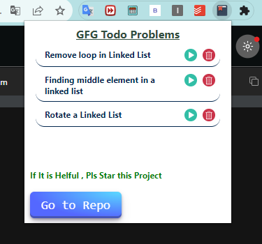
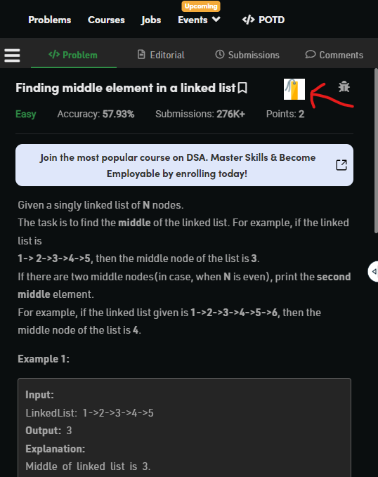
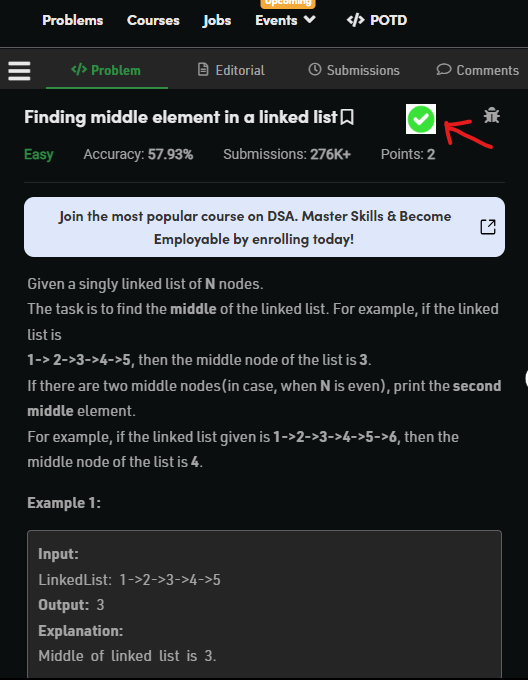

# GFG_todo_list
<ul>
  <li>A todo list of GFG problems to complete our daily targets </li>
  <li>With this you can bookmark any problems on GFG and redirect to it from anywhere</li>
</ul>

How looks our Extension

<h4>I am attaching some reference</h4>

After Click BookMark Button

